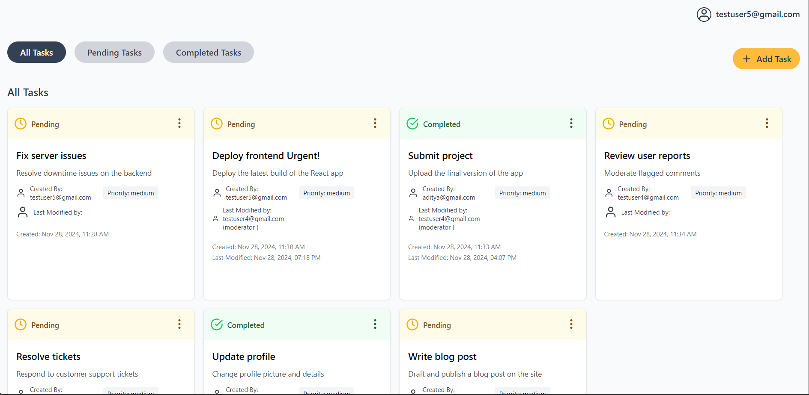
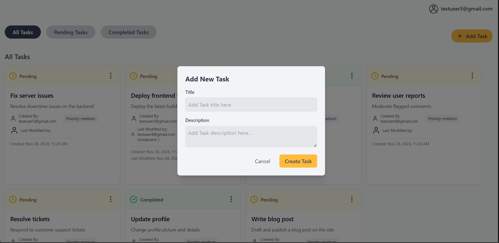
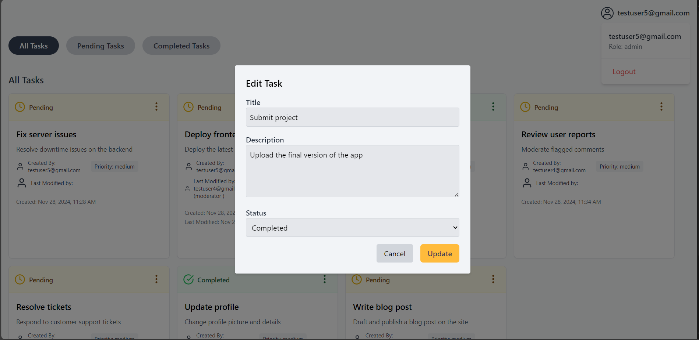
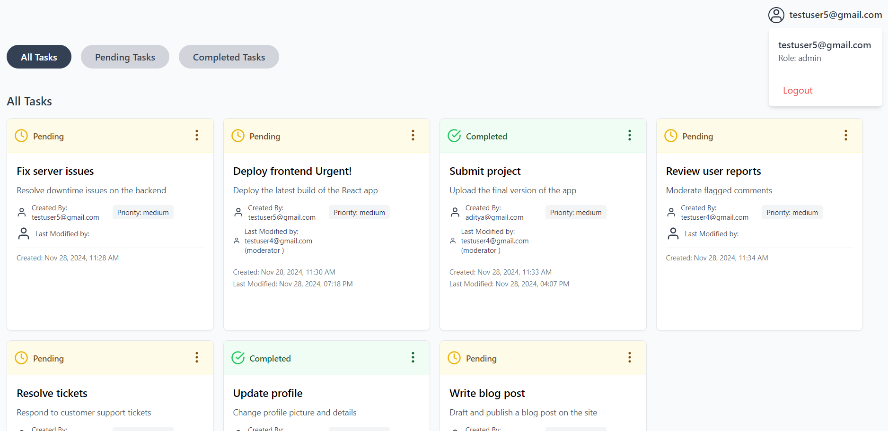
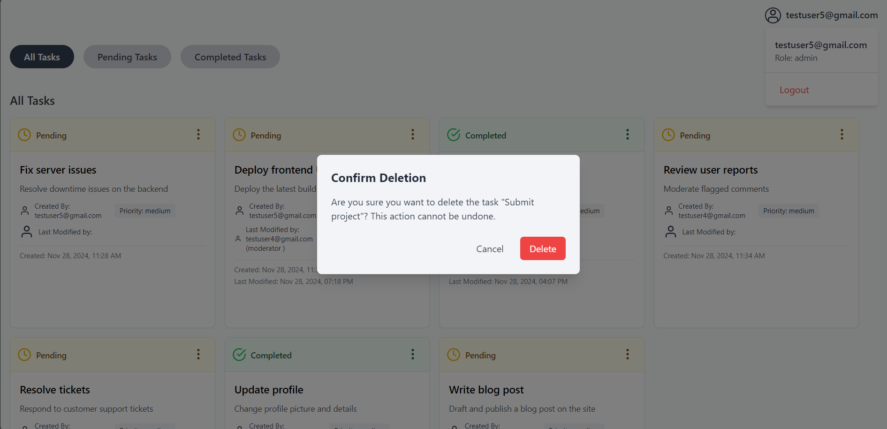

# Task Management RBAC Demo (React, Node, Express)

Welcome to the **Task Management RBAC Demo**! This project demonstrates the implementation of **Role-Based Access Control (RBAC)** in a simple task management application. The application is built using **React** for the frontend and **Node.js** with **Express.js** for the backend.

---

## Project Overview

In this demo, we showcase how RBAC can be implemented in the simplest way to control access to certain resources in a task management app. There are different user roles with various levels of permissions:

- **Admin**: Has access to **all** tasks and can **create, read, update,** and **delete** any task.
- **Moderator**: Has access to **all** tasks but can only **read** and **update** them. Cannot create or delete tasks for the other users.
- **User**: Can only manage **their own tasks**. The permissions include creating, reading, updating, and deleting their own tasks.

---

## User Roles & Permissions

The app uses the following **roles** and **permissions**:

### Permissions

- **task:create_own**: Create a task for yourself.
- **task:read_own**: Read your own tasks.
- **task:update_own**: Update your own tasks.
- **task:delete_own**: Delete your own tasks.

### Roles

1. **Admin**:

   - Permissions: All task permissions (`task:create_any`, `task:read_any`, `task:update_any`, `task:delete_any`) + user permissions for their own tasks (`task:create_own`, `task:read_own`, `task:update_own`, `task:delete_own`).

2. **Moderator**:

   - Permissions: Can manage any task's visibility (`task:read_any`, `task:update_any`) but only their own tasks can be created, updated, or deleted.

3. **User**:
   - Permissions: Can only manage their own tasks (`task:create_own`, `task:read_own`, `task:update_own`, `task:delete_own`).

### User Example Data

| **Username**        | **Password** | **Role**  |
| ------------------- | ------------ | --------- |
| aditya@gmail.com    | 123456       | user1     |
| testuser3@gmail.com | hello$123    | user2     |
| testuser4@gmail.com | hello$123    | moderator |
| testuser5@gmail.com | hello$123    | admin     |

### Tasks Example

| **Task ID** | **Task Title**      | **Task Description**                      | **Assigned User (ID)** |
| ----------- | ------------------- | ----------------------------------------- | ---------------------- |
| 1           | Fix server issues   | Resolve downtime issues on the backend    | admin (User ID: 1)     |
| 2           | Review user reports | Moderate flagged comments                 | moderator (User ID: 2) |
| 3           | Submit project      | Upload the final version of the app       | user1 (User ID: 3)     |
| 4           | Update profile      | Change profile picture and details        | user2 (User ID: 4)     |
| 5           | Deploy frontend     | Deploy the latest build of the React app  | admin (User ID: 1)     |
| 6           | Write blog post     | Draft and publish a blog post on the site | user1 (User ID: 3)     |
| 7           | Resolve tickets     | Respond to customer support tickets       | moderator (User ID: 2) |

---

## Running the Project

### 1. Backend Setup (Node + Express)

1. Clone the repository.
2. Navigate to the **backend** directory.
3. Install the required dependencies:
   ```bash
   npm install
   ```
4. Create a `.env` file in the **backend** root directory with the following structure:

   ```
   JWT_SECRET=your_jwt_secret
   DB_URI=your_database_url
   PORT=8000
   ```

5. Run the server:
   ```bash
   npm run start
   ```

This will start the backend server at `http://localhost:8000`.

### 2. Frontend Setup (React + Vite)

1. Navigate to the **frontend** directory.
2. Install the required dependencies:
   ```bash
   npm install
   ```
3. Create a `.env.local` file in the **frontend** root directory with the following structure:

   ```
   VITE_API_URL=http://localhost:8000/api
   ```

4. Run the React app:
   ```bash
   npm run dev
   ```

This will start the frontend app at `http://localhost:3000`.

---

## Application Flow

### 1. **Login Form**

Users start by logging into the application. The login form allows them to enter their credentials to authenticate.


### 2. **Registration Form**

New users can register by filling out the registration form. A user can specify their username, password, and role during registration.


### 3. **Registration with Roles**

A new user registers and is assigned a role (Admin, Moderator, or User). This determines their access level in the system.


### 4. **Dashboard After Login**

After successful login, users are redirected to the dashboard. The dashboard displays the tasks assigned to the user based on their role and permissions.



### 5. **Adding a New Task**

Admins and users with the required permissions can add new tasks. The form allows users to fill in the task title and description.



### 6. **Editing a Task**

Once tasks are created, users can edit them by clicking the "three dots" (more options) next to each task.



### 7. **Logout and View User Roles**

Users can log out from the system, and admins can view user roles to manage access permissions.



### 8. **Deleting a Task**

Users with delete permissions can delete tasks. A confirmation prompt appears before deletion to ensure the action is intentional.



---

## API Endpoints

### 1. **POST /api/register** - Register a new user

- Body: `{ "username": "user@example.com", "password": "password123", "role": "user" }`
- Response: `201 Created` or `400 Bad Request` if validation fails or user already exists.

### 2. **POST /api/login** - Login a user and get JWT token

- Body: `{ "username": "user@example.com", "password": "password123" }`
- Response: `200 OK` with the JWT token.

### 3. **GET /api/tasks** - Get all tasks (RBAC-based visibility)

- Only accessible by users with `task:read_any` or `task:read_own` permissions.

### 4. **POST /api/tasks** - Create a new task

- Accessible based on user role: Admin can create any task, User can only create their own.

### 5. **PUT /api/tasks/:taskId** - Update a task

- Accessible based on role and task ownership.

### 6. **DELETE /api/tasks/:taskId** - Delete a task

- Admins and the task owner can delete the task.

---

## Environment Variables

### Backend `.env`

```env
JWT_SECRET=your_jwt_secret
DB_URI=your_database_url
PORT=8000
```

### Frontend `.env`

```env
VITE_API_URL=http://localhost:8000/api
```

---

## Dependencies

### Backend (Node + Express)

- **bcryptjs**: For hashing passwords.
- **cors**: For enabling Cross-Origin Resource Sharing (CORS).
- **dotenv**: For loading environment variables.
- **express**: Web framework for Node.js.
- **joi**: For input validation.
- **jsonwebtoken**: For generating and verifying JWT tokens.

### Frontend (React + Vite)

- **axios**: For making HTTP requests to the backend.
- **react**: The main React library.
- **react-dom**: For rendering React components.
- **react-hook-form**: For handling form validation.
- **react-hot-toast**: For showing notifications.
- **react-router-dom**: For routing in React.

---

## Conclusion

This project is a simple yet powerful demonstration of how to implement **Role-Based Access Control (RBAC)** in a modern web application using **React** for the frontend and **Node.js + Express** for the backend. The application uses JWT authentication, form validation, and access control based on user roles. It can easily be extended or integrated into more complex applications.

Thank you for checking out the project! Feel free to modify and adapt it for your own use cases. 😊
